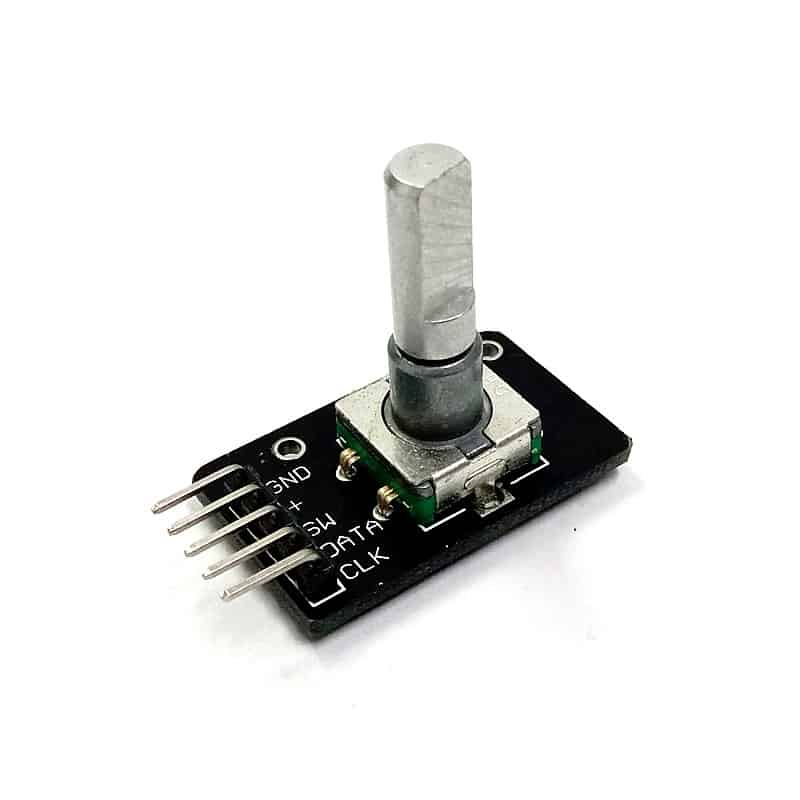
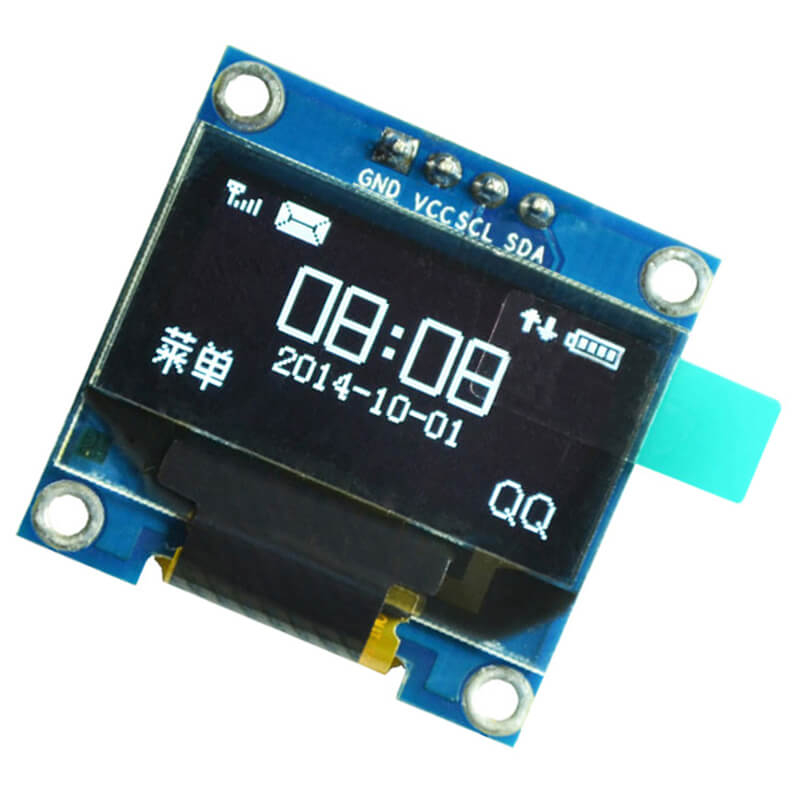

# Puirume: Concept

Puirume, simple user interface with Raspberry Pi Pico.
Puirume is terminology consist of 3 words, "p" for Raspberry Pi Pico, "ui" for user interface, and "rume" for RumeLab.

It is deal for many embedded system to have a user interface to interact with the system.
Unfortunately, setting up an user interface by itself could be as challenging as the main mechanism.
This makes development in less ease as some efforts are diverted away from the main mechanism.
To mitigate this issue, it would be beneficial to explore an user interface system having the criteria of:

- usable, being responsive on browse and select item from a list;
- minimal, having as less component and take less space as possible;
- budget, having cheap price tag.

The user interface consiste of two components, input and output.
The proposed input component is the KY040 rotary encoder with button switch, as illustrated in Figure 1.
The rationale of this proposal is the fact that it accepts two different inputs in one module, rotary motion and push motion.
The rotary motion could be use for browsing while push motion could be use for selection or comfirmation.

 \
_Figure 1: KY040_

Pertaining output, the proposed output component is the 0.96" SDD1306 OLED display, as shown in Figure 2.
Although it is smaller than the usual 16x2 LCD screen, the compactness takes less space.
Moreover, it has the ability to display beyond text.

 \
_Figure 2: SDD1306_
